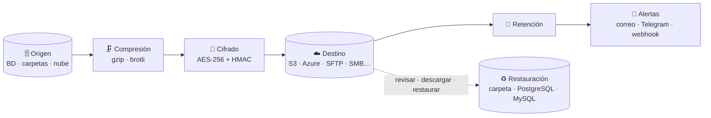

<div align="center">

# 🛡️ BackupHub

**Respaldos multi-tenant, cifrados y programados, que se pueden revisar y restaurar desde la web.**

[](https://dotnet.microsoft.com/)
[](https://learn.microsoft.com/aspnet/core/blazor/)
[](https://learn.microsoft.com/ef/core/)
[](#-arranque-rápido)
[](docs/alertas.md)
[](LICENSE)

[Arranque rápido](#-arranque-rápido) ·
[Instructivo](docs/instructivo.md) ·
[Documentación](docs/README.md) ·
[Despliegue](docs/despliegue.md) ·
[Arquitectura](docs/arquitectura.md)

</div>

---

BackupHub toma datos de un **origen**, los **comprime y cifra**, los envía a un **destino** y permite **revisarlos y restaurarlos** después. Tiene programación, retención automática, historial en vivo y avisos cuando algo falla. Todo se maneja desde una interfaz web en **.NET 10 + Blazor Server**, lista para correr en un contenedor.



## ✨ Características

<table>
<tr>
<td width="50%" valign="top">

**📦 Respaldos**
- Asistente paso a paso, con explorador de carpetas remoto y selección de lo que se incluye o excluye
- **Conexiones** reutilizables: los datos de acceso se configuran una vez y se usan en varios trabajos
- Botón **Elegir** para bases de datos y esquemas, consultados al servidor
- Compresión gzip / brotli y cifrado AES-256 + HMAC-SHA256
- Programación diaria, semanal (varios días), mensual o cron, en la zona horaria que elijas
- Retención por cantidad y por antigüedad
- Duplicar trabajos y pausarlos

</td>
<td width="50%" valign="top">

**♻️ Revisar y restaurar**
- Bitácora en vivo, que se puede copiar o descargar
- Estado **Con advertencias** cuando se omitió algo (y se avisa)
- Descargar el respaldo tal cual o ya descifrado y descomprimido, con **verificación SHA-256**
- Ver el contenido de un `.zip` y descargar archivos sueltos, o el índice de un dump de PostgreSQL
- **Restaurar desde la web**, con un destino predeterminado por trabajo, restauración sobre el origen u otro destino
- Historial de restauraciones: qué, dónde, quién y cómo terminó

</td>
</tr>
<tr>
<td width="50%" valign="top">

**👥 Plataforma**
- Multi-tenant con aislamiento total de datos
- Roles: super administrador, administrador y lector
- Invitaciones y recuperación de contraseña por correo
- Alertas por correo, Telegram (privado y grupos) y webhook

</td>
<td width="50%" valign="top">

**🔐 Seguridad**
- Secretos cifrados en reposo con Data Protection; nunca vuelven al navegador
- Descargas y restauraciones solo para administradores del tenant
- Sin credenciales en los registros de restauración

</td>
</tr>
</table>

### 🔌 Proveedores

| | Orígenes | Destinos | Restaurar en |
|---|---|:---:|---|
| 🗄️ **Bases de datos** | SQL Server · PostgreSQL · MySQL/MariaDB · MongoDB · SQLite | — | PostgreSQL · MySQL/MariaDB |
| 📁 **Archivos** | Carpeta local · FTP/FTPS · SFTP · SMB | ✅ los mismos | Carpeta local · FTP/FTPS · SFTP · SMB |
| ☁️ **Nube** | S3 y compatibles · Azure Blob | ✅ los mismos | (sus `.zip`, en los de archivos) |

---

## 🚀 Arranque rápido

### Con Docker

```bash
docker compose up -d --build              # solo la app → http://localhost:8080
docker compose --profile demo up -d       # + PostgreSQL, S3 (SeaweedFS) y SFTP de prueba
```

En el primer arranque se crea el tenant `Principal` y el super administrador `admin@backup.local`. Si no definiste `BACKUP_ADMIN_PASSWORD`, la contraseña se genera y aparece **una sola vez** en el log:

```bash
docker logs backuphub 2>&1 | grep "Administrador inicial"
```

Cámbiala en **Mi cuenta** después de entrar. Para el primer respaldo, sigue el [instructivo](docs/instructivo.md).

> [!IMPORTANT]
> El volumen `backup-data` (`/data`) guarda la base SQLite **y las llaves de cifrado**. Si se pierden las llaves, las contraseñas guardadas no se pueden descifrar. Inclúyelo en tus propios respaldos.

<details>
<summary><b>🧪 Valores para probar con el perfil <code>demo</code></b></summary>

<br/>

| Tipo | Configuración |
|---|---|
| Origen PostgreSQL | Host `postgres` · Puerto `5432` · BD `tienda` · Usuario `postgres` · Contraseña `demo1234` |
| Destino S3 | Bucket `respaldos` · Endpoint `http://s3:8333` · Path-style ✓ · Access key `demo` · Secret `demo1234` · Crear bucket ✓ |
| Destino SFTP | Host `sftp` · Puerto `22` · Usuario `demo` · Contraseña `demo1234` · Carpeta `/respaldos` |
| Destino carpeta local | Ruta `/backups` |

</details>

<details>
<summary><b>💻 Sin Docker (desarrollo)</b></summary>

<br/>

Requiere el SDK de .NET 10. Para las bases de datos se necesitan además sus clientes en el `PATH`: `pg_dump`, `pg_restore` y `psql`; `mysqldump` y `mysql`; `mongodump`.

```bash
dotnet run --project src/Backup.Web        # → http://localhost:5003
```

Los datos quedan en `src/Backup.Web/data/` salvo que definas `Backup__DataDirectory`.

</details>

---

## 📚 Documentación

| Guía | Contenido |
|---|---|
| [🧭 Instructivo](docs/instructivo.md) | De cero a un respaldo revisado y restaurado, paso a paso. |
| [📋 Trabajos y ejecuciones](docs/trabajos.md) | El asistente, la programación, los estados, la bitácora y las acciones sobre cada ejecución. |
| [🔑 Conexiones](docs/conexiones.md) | Datos de acceso reutilizables entre trabajos. |
| [🗄️ Bases de datos](docs/bases-de-datos.md) | Elegir bases y esquemas, usuario de solo lectura, RLS y servicios gestionados. |
| [📁 Proveedores de archivos](docs/proveedores-archivos.md) | Carpeta local, FTP/FTPS, SFTP y SMB: rutas, selección, codificación de nombres y problemas frecuentes. |
| [♻️ Revisar y restaurar](docs/restaurar.md) | Descargar, ver el contenido, restaurar desde la web o a mano. |
| [🔔 Alertas](docs/alertas.md) | Correo, Telegram y webhook. |
| [👥 Usuarios, roles y tenants](docs/usuarios-y-tenants.md) | Roles, registro, usuarios, tenants y recuperación de contraseña. |
| [⚙️ Configuración](docs/configuracion.md) | Variables de entorno. |
| [🌐 Despliegue en servidor](docs/despliegue.md) | Imagen Docker, `.env` de ejemplo, HTTPS y espacio en disco. |
| [🔐 Seguridad y operación](docs/seguridad.md) | Llaves, secretos, permisos, integridad y buenas prácticas. |
| [🏗️ Arquitectura](docs/arquitectura.md) | Proyectos, flujos y cómo extender BackupHub. |
| [🧑‍💻 Desarrollo](docs/desarrollo.md) | Compilar, pruebas y migraciones. |

---

## 🗺️ Pendiente

- [ ] Restaurar SQL Server (`.bak`) y MongoDB desde la web
- [ ] Bot de Telegram por tenant (hoy hay uno por plataforma)
- [ ] Alerta cuando un trabajo programado no se ejecuta a tiempo

---

## 📄 Licencia

Distribuido bajo la licencia **MIT**. Consulta el archivo [LICENSE](LICENSE) para más detalles.

<div align="center">
<sub>© 2026 Steven Gazo Maliaño</sub>
</div>
