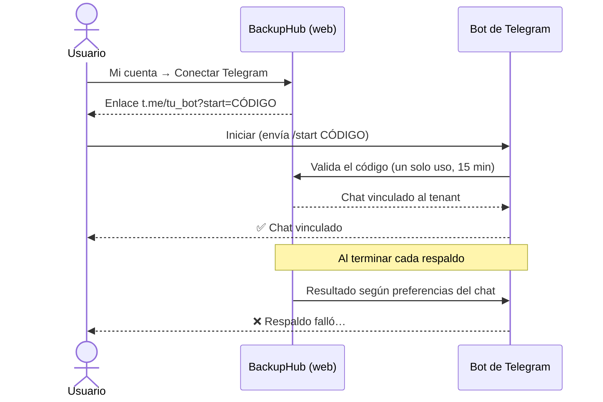

[← Documentación](README.md)

# 🔔 Alertas

Se envían cuando una ejecución termina **fallida, cancelada o con advertencias**, y opcionalmente también cuando termina **correctamente**. "Con advertencias" cuenta como fallo para los avisos, porque el respaldo quedó incompleto (ver [estados](trabajos.md#estados-de-una-ejecución)). El envío no retrasa el cierre de la ejecución, y un fallo de envío solo queda en el log.

| Canal | Quién lo configura | Alcance |
|---|---|---|
| 📧 Correo | Administrador del tenant | Destinatarios del tenant |
| ✈️ Telegram | Cada usuario | Su chat privado o un grupo |
| 🪝 Webhook | Operador (variable de entorno) | Todos los tenants |

## 📧 Correo

**Administración → Alertas** (administradores del tenant):

1. Activa las alertas y elige cuándo avisar (fallos y/o éxitos).
2. Escribe los destinatarios, separados por coma o uno por línea.
3. Elige el servidor:
   - **Servidor de la plataforma**: aparece solo si el operador configuró `Smtp__*`.
   - **SMTP propio**: servidor, puerto, seguridad, usuario, contraseña y remitente, con atajos para los proveedores más comunes.
4. Pulsa **Enviar correo de prueba** (usa lo que está en pantalla, sin guardarlo) y luego **Guardar**.

La contraseña SMTP se guarda cifrada y nunca vuelve al navegador: si dejas el campo vacío, se conserva la guardada.

| Proveedor | Servidor | Puerto | Seguridad | Nota |
|---|---|:---:|---|---|
| Microsoft 365 | `smtp.office365.com` | 587 | STARTTLS | El buzón debe tener *SMTP AUTH* habilitado. |
| Gmail / Workspace | `smtp.gmail.com` | 587 | STARTTLS | Requiere una *contraseña de aplicación*. |
| Zoho | `smtp.zoho.com` | 465 | SSL/TLS | |
| SendGrid | `smtp.sendgrid.net` | 587 | STARTTLS | Usuario `apikey`, contraseña = API key. |

## ✈️ Telegram

Cada usuario (incluidos los lectores) se suscribe a las alertas de su tenant desde Telegram, en un chat privado o en un grupo.



**1. Crear el bot** <sub>(una vez, lo hace el operador)</sub>

1. En Telegram, abre [@BotFather](https://t.me/BotFather) y envía `/newbot`. Elige un nombre y un usuario terminado en `bot`.
2. Copia el token (`123456789:AA...`) en `Telegram__BotToken` (o `TELEGRAM_BOT_TOKEN` en `.env`) y reinicia el contenedor.
3. En el log debe aparecer `Bot de Telegram conectado: @tu_bot`.

> [!NOTE]
> El bot recibe los mensajes con *long polling* (`getUpdates`): **no necesita URL pública ni puertos abiertos**, solo salida HTTPS a `api.telegram.org`. Por eso el token no debe usarse en otra aplicación con webhook ni en otra instancia de BackupHub al mismo tiempo (Telegram respondería 409 y el log lo indica).

**2. Suscribirse** <sub>(cada usuario)</sub>

1. Ve a **Mi cuenta → Telegram → Conectar Telegram**.
2. Pulsa **Abrir chat con @tu_bot** y luego **Iniciar**, o **Agregar a un grupo** para que el grupo reciba las alertas. Si el enlace no abre, envía al bot el mensaje `/start CÓDIGO` que muestra la pantalla.
3. La página se actualiza sola al vincular. El código es de un solo uso y caduca en 15 minutos.
4. Elige por chat si quieres **fallos**, **éxitos** o ambos, y usa ⚡ para enviar un mensaje de prueba.

En **Administración → Alertas → Telegram** los administradores ven todos los chats del tenant y pueden desvincularlos.

| Comando | Acción |
|---|---|
| `/start CÓDIGO` | Vincula el chat al tenant del código. |
| `/estado` | Muestra de qué tenants recibe alertas el chat. |
| `/stop` | Deja de recibir alertas en ese chat. |
| `/ayuda` | Explica cómo suscribirse. |

Si alguien bloquea al bot o lo saca de un grupo, la suscripción se elimina automáticamente. Al eliminar un usuario también se eliminan los chats que vinculó.

## 🪝 Webhook

Con `Notifications__Webhook__Url`, cada ejecución terminada envía un JSON como este. El campo `text` sirve directamente para Teams o Slack, y `status` es `Succeeded`, `Warning`, `Failed` o `Cancelled`:

```json
{
  "text": "❌ Respaldo 'ERP' falló: Conexión rechazada",
  "job": "ERP",
  "jobId": "5f0c…",
  "runId": "9a2e…",
  "status": "Failed",
  "trigger": "Scheduled",
  "startedAt": "2026-09-29T02:00:00Z",
  "finishedAt": "2026-09-29T02:00:04Z",
  "artifact": null,
  "sizeBytes": 0,
  "sha256": null,
  "error": "Conexión rechazada"
}
```
