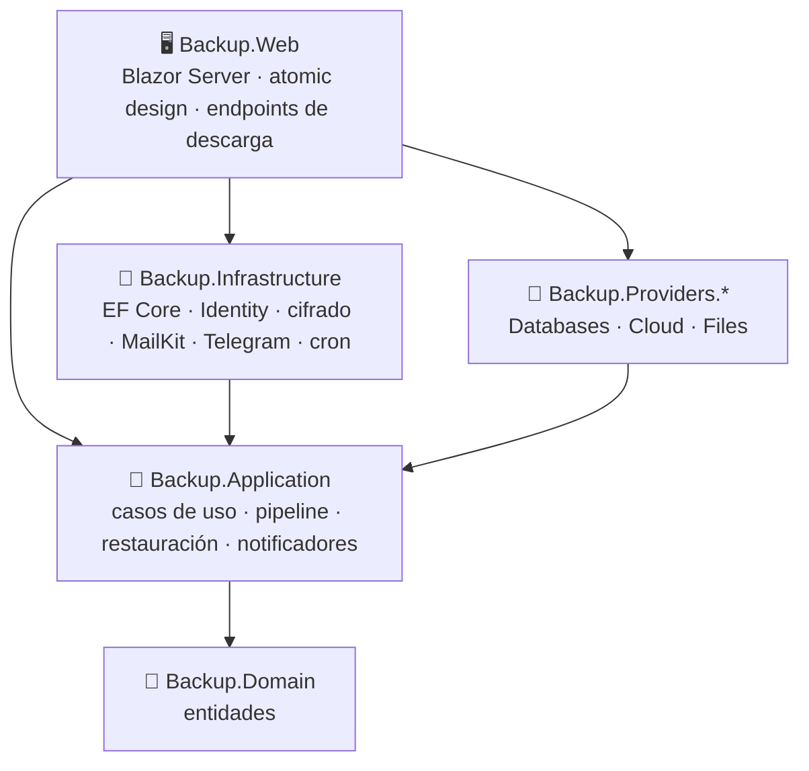

[← Documentación](README.md)

# 🏗️ Arquitectura



```
src/
  Backup.Domain              Entidades: BackupJob (origen, destino, destino de restauración), BackupRun,
                             RestoreOperation, Connection, Tenant, NotificationSettings, TelegramSubscription
  Backup.Application         Puertos, pipeline y casos de uso: JobService, ConnectionService (+ ConnectionResolver),
                             ArtifactService, RestoreService (+ RestoreRunner), DashboardService, TenantService,
                             NotificationService, TelegramService; notificadores de correo y Telegram
  Backup.Infrastructure      EF Core/SQLite, Identity, Data Protection, compresión, AES-256+HMAC y su decodificador,
                             cron, cola, ejecución de procesos, MailKit, Bot API de Telegram (long polling), webhook
  Backup.Providers.*         Plugins de origen, destino y restauración
  Backup.Web                 Atoms → Molecules → Organisms → Templates → Pages
tests/Backup.Tests           Unitarias y extremo a extremo
```

## Flujos

**Respaldo:**
1. `SchedulerService` (cron) o el botón *Ejecutar* encolan el trabajo en `BackupQueue`.
2. `BackupWorker` llama a `BackupRunner`, que primero combina el trabajo con sus conexiones guardadas (`ConnectionResolver`).
3. Pide los datos al `IBackupSource`, los pasa por las transformaciones (`IStreamTransform`: compresión y cifrado) y los entrega al `IBackupDestination`.
4. Aplica la retención.
5. Cada `IRunNotifier` (UI en vivo, correo, Telegram, webhook) recibe el resultado. La bitácora se publica cada pocos segundos mientras la ejecución avanza.

**Revisión:** `ArtifactService` descarga el artefacto con `IArtifactReader` a una caché temporal, verifica su SHA-256 y revierte cifrado y compresión con `IArtifactDecoder`. Luego lista su contenido: entradas del `.zip` o `pg_restore --list`. Los endpoints `/runs/{id}/artifact` y `/runs/{id}/artifact/entry` entregan los archivos.

**Restauración:**
1. `RestoreService` valida el destino, completa los secretos guardados (del destino del trabajo o del origen) y registra una `RestoreOperation`.
2. `RestoreRunner` la ejecuta en segundo plano: prepara el artefacto con `ArtifactService` y llama al `IRestoreTarget` elegido, publicando su bitácora en vivo.

## 🧩 Extender BackupHub

Los proveedores se describen con un `ProviderDescriptor`: nombre, icono y campos (`SettingField`). La UI genera sus formularios a partir de esos metadatos, así que agregar un proveedor no requiere tocar la interfaz.

| Interfaz | Para qué |
|---|---|
| `IBackupSource` | Generar el artefacto. `ArtifactExtension` indica qué extensión producirá, para ofrecer destinos de restauración compatibles. |
| `IBackupDestination` | Subir, listar (retención) y borrar artefactos. |
| `IArtifactReader` | Descargar un artefacto ya subido (revisar y restaurar desde la web). |
| `IRestoreTarget` | Recibir una restauración: qué artefactos admite (`CanRestore`), sus campos (`RestoreFields`) y cómo restaurar. |
| `IConnectionTester` | Botón **Probar conexión**. |
| `IFolderBrowser` / `IFolderCreator` | Explorador de carpetas y **Nueva carpeta**. |
| `IOptionLister` | Botón **Elegir** en los campos marcados con `.Listable()` (bases de datos, esquemas…). |

Cómo se describen los campos:

- **`.ForConnection()`:** el campo es un dato de acceso (host, usuario, contraseña…) y se puede guardar en una [conexión](conexiones.md). El resto son propios de cada trabajo.
- **`SettingField.Secret`:** el campo se cifra en reposo y nunca vuelve al navegador.
- **`.Browsable()`:** el campo ofrece el explorador de carpetas.

Los proveedores se registran con `AddBackupSource<T>()` / `AddBackupDestination<T>()`. Un proveedor que además implemente `IRestoreTarget` aparece automáticamente como destino de restauración.

**Agregar un canal de alertas:** implementa `IRunNotifier` y regístralo con `AddSingleton<IRunNotifier, TuNotificador>()`. Los notificadores existentes muestran el patrón: filtran por tenant y preferencias, ignoran las ejecuciones en curso y envían en segundo plano sin propagar errores.
