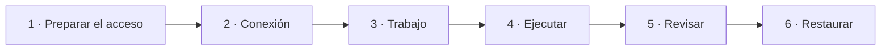

[← Documentación](README.md)

# 🧭 Instructivo: del primer respaldo a la primera restauración

Esta guía lleva de cero a un respaldo **programado, revisado y restaurado**. Usa como ejemplo una base PostgreSQL, y en cada paso indica qué cambia si respaldas una carpeta (FTP, SFTP, SMB o una carpeta local).

Necesitas entrar con un usuario **administrador**. Los lectores solo ven el panel y el historial.



## 1. Preparar el acceso en el origen

Usa una cuenta **dedicada a los respaldos**, que no use ninguna persona ni aplicación. Así puedes darle los permisos de lectura que necesita sin abrir nada más, y cambiar su contraseña sin afectar a nadie.

**Base de datos.** Crea un usuario de solo lectura. Ejemplo para PostgreSQL, ejecutado como propietario de las tablas o como administrador:

```sql
CREATE ROLE respaldos LOGIN PASSWORD 'una-contraseña-larga-y-única';
GRANT USAGE ON SCHEMA public TO respaldos;
GRANT SELECT ON ALL TABLES IN SCHEMA public TO respaldos;
GRANT SELECT ON ALL SEQUENCES IN SCHEMA public TO respaldos;
ALTER DEFAULT PRIVILEGES IN SCHEMA public GRANT SELECT ON TABLES TO respaldos;
ALTER DEFAULT PRIVILEGES IN SCHEMA public GRANT SELECT ON SEQUENCES TO respaldos;
-- Solo si tus tablas usan seguridad por fila (RLS):
ALTER ROLE respaldos BYPASSRLS;
```

Repite los `GRANT` para cada esquema que quieras respaldar. [Bases de datos](bases-de-datos.md) explica cada permiso y qué hacer si tu servicio no permite `BYPASSRLS`.

**Carpeta.** Crea en el FTP, SFTP o SMB un usuario con **solo lectura** sobre las carpetas a respaldar.

## 2. Guardar la conexión

**Administración → Conexiones → Nueva conexión:**

1. Elige el tipo (PostgreSQL, FTP, SMB…).
2. Ponle un nombre que identifique el servidor, por ejemplo `ERP producción` o `NAS oficina`.
3. Completa host, puerto, usuario y contraseña. Para un servicio en la nube, normalmente también SSL `require`.
4. Pulsa **Probar conexión** (en PostgreSQL y SQL Server se prueba desde el trabajo, porque necesita la base) y **Crear conexión**.

La conexión se usa en todos los trabajos que la elijan. Si mañana cambia la contraseña, la actualizas en un solo lugar. Más en [Conexiones](conexiones.md).

## 3. Crear el trabajo

**Trabajos → Nuevo trabajo.** El asistente tiene siete pasos:

| Paso | Qué hacer |
|---|---|
| **General** | Nombre (por ejemplo `erp-diario`); el destino tendrá una carpeta con ese nombre. |
| **Origen** | Elige el tipo y, en **Datos de acceso**, la conexión del paso 2. Luego lo propio del trabajo: **Base de datos** y **Esquemas** con el botón **Elegir**. *Carpeta:* **Carpeta remota** con **Explorar** y, en **Archivos y carpetas**, marca lo que se respalda y desmarca lo que no. |
| **Destino** | Dónde se guardan los respaldos: carpeta local, SFTP, SMB, S3, Azure… También puede usar una conexión guardada. |
| **Programación** | **Diario**, **Semanal** (marca uno o varios días) o **Mensual** (elige el día), más la hora. Revisa la zona horaria: las próximas ejecuciones se muestran debajo. |
| **Opciones** | Activa el **cifrado** y guarda la contraseña también fuera de BackupHub: sin ella no se puede restaurar. Ajusta la retención (por ejemplo, los últimos 14). |
| **Restauración** | Opcional: a dónde se restaurará por defecto (paso 6). |
| **Resumen** | Revisa y pulsa **Crear trabajo**. |

## 4. Ejecutarlo por primera vez

En **Trabajos**, pulsa **Ejecutar ahora** y abre la ejecución en **Historial**. La bitácora se actualiza en vivo.

- **Correcto:** el respaldo se subió completo.
- **Con advertencias:** se subió, pero se omitió algo (por ejemplo, un archivo que desapareció durante la copia). La bitácora dice qué.
- **Falló:** la bitácora explica la causa y, en los errores habituales de permisos, trae el comando exacto para corregirlo.

## 5. Revisar el respaldo

En la ejecución, sección **Respaldo**:

1. **Ver contenido.** En una base de datos, el índice de tablas y datos. En una carpeta, la lista de archivos, que se pueden descargar sueltos.
2. **Descargar**, si lo necesitas: tal cual (cifrado) o listo para usar.

BackupHub verifica que el archivo del destino coincida con su SHA-256 antes de mostrar o entregar nada.

## 6. Restaurarlo en un entorno de prueba

Un respaldo que nunca se restauró no está probado. Hazlo en un servidor o carpeta **de prueba**, nunca sobre producción la primera vez.

1. *(Una vez)* Edita el trabajo y, en el paso **Restauración**, define el destino de prueba: por ejemplo PostgreSQL con host `db-pruebas` y base `erp_prueba`, o una carpeta `/restauraciones/erp`.
2. En la ejecución, pulsa **Restaurar**. Viene elegido el **Destino del trabajo**.
3. Revisa las opciones. Para una base de prueba, **Borrar la base completa y crearla de nuevo** deja una copia limpia cada vez.
4. Confirma y sigue la bitácora en vivo. Queda registrada en **Restauraciones**.
5. Comprueba los datos restaurados: cuenta filas de algunas tablas o abre algunos archivos.

Repite esta prueba periódicamente. Más en [Revisar y restaurar](restaurar.md).

## Lista de verificación

- [ ] Cuenta de respaldo dedicada y de solo lectura en el origen.
- [ ] Conexión guardada y probada.
- [ ] Trabajo con cifrado activado y su contraseña guardada fuera de BackupHub.
- [ ] Programación y retención revisadas.
- [ ] Alertas configuradas para fallos (**Administración → Alertas**, ver [Alertas](alertas.md)).
- [ ] Primer respaldo revisado con **Ver contenido**.
- [ ] Restauración de prueba completada y datos comprobados.
- [ ] Volumen `/data` de BackupHub (base y llaves) incluido en tus propios respaldos.
